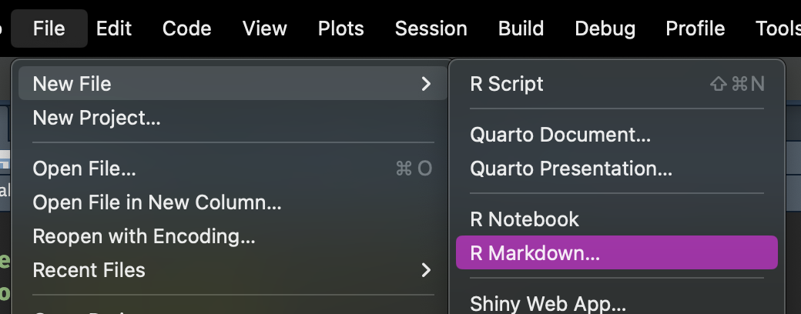
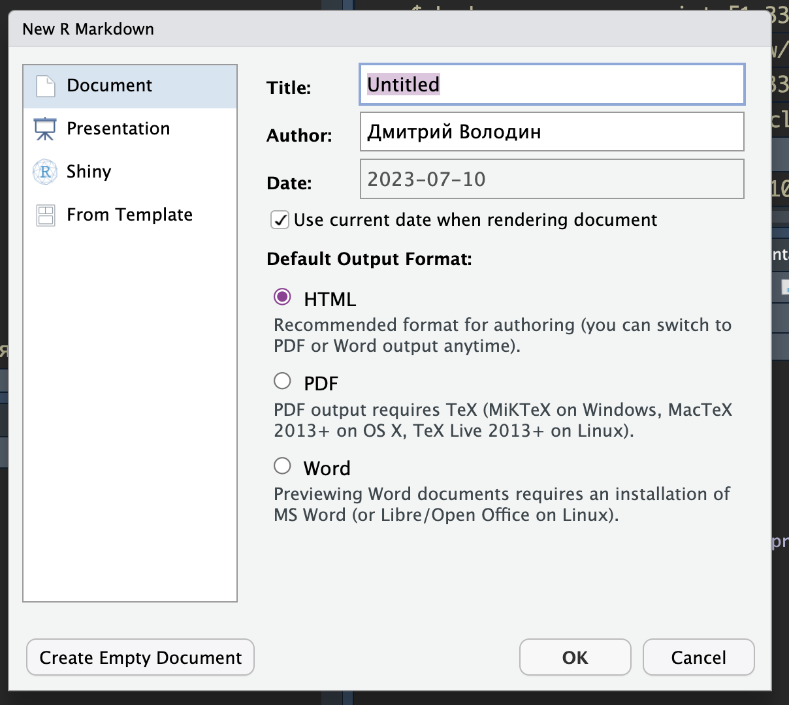

# Содержание

1.  [Введение](#Введение)
2.  [Markdown](#Markdown)
3.  [R code](#R)
4.  [Другие языки](#Other)
5.  [Rendering](#Rendering)

# Введение {#введение}

При создании RMarkdown документа в заголовке появляется YAML конфигурация.

```         
title: 'заголовок документа'
author: "автор"
date: "дата"
output: формат вывода (html, pdf, docx)
```

------------------------------------------------------------------------

Созздание RMarkdown из RStudio





# Markdown {#markdown}

Markdown - язык разметки. Позволяет форматировать вывод текста.

*Можно весь текст сделать курсивным*

**Можно сделать весь текст жирным** ***Можно сочетать.*** Тут нет абзаца, потому что нет пропущенной строки.

возведение в^степень^

------------------------------------------------------------------------

Заголовки: чем больше решёток - тем меньше шрифт

Содержание можно создать с помощью ссылок на заголовки (**см код содержания**)

------------------------------------------------------------------------

Ссылки создаются таким обюразом: `[text](link)`

[Наша любимая обучающая платформа](https://otus.ru/)


------------------------------------------------------------------------

Простой список:

-   Item 1
-   Item 2
    -   Item 2.1
    -   Item 2.2

------------------------------------------------------------------------

Нумерованный список:

1.  Item 1
2.  Item 1

------------------------------------------------------------------------

Задачи

-   [ ] New task
-   [x] Done task

------------------------------------------------------------------------

Переменные R в тексте. r call в бэктиках

Факториал 10: `r factorial(10)`

Средний расстояние (в милях), которое можно проехать на одном галлоне топлва: **`r mean(mtcars$mpg)`**

> блок текста (часто используется для цитат)

# R {#r}

Чтобы создавать вызовы интерпретатора R, нужно ограничить блок вот так:

```{r prereq, include=FALSE}
library(tidyverse)
library(palmerpenguins)
library(gt)

clean_penguins <- penguins %>% drop_na()
```

------------------------------------------------------------------------

{r prereq, **include=FALSE**} include=FALSE означет, что код в чанке выполнится, но не вывод кода в консоль не будет произведен.

```{r head, echo=FALSE}
clean_penguins %>% 
  head() %>% 
  gt()
```

**echo=FALSE** означает, что будет выведен только результат вызова, а сам код не будет отображен.

**eval=FALSE** означает, что вызов не будет произведён.

------------------------------------------------------------------------

Последовательность выполнения (правильная)

```{r}
x <- rnorm(100)
```

Другой чанк

```{r}
mean(x)
```

------------------------------------------------------------------------

последовательность выполнения (неправильная)

```{r}
#mean(y)
```

Следующий чанк

```{r}
y <- runif(1000)
```

------------------------------------------------------------------------

Графики

```{r plot, echo=FALSE, fig.height=9, fig.width=9}
ggplot(clean_penguins, aes(x = body_mass_g, fill = sex))+
  geom_density(alpha = 0.5)+
  facet_grid(rows = vars(species))
```

# Shiny

Чтобы использовать элементы шайни в отчёте, нужно поставить настройку runtime: shiny в YAML-заголовке.

К сожалению с шайни выводом не так всё просто и для него нужна живая R сессия. То есть просто приложить его как html документ не получится. Он его и не создаёт.

Здесь будет вход (ui)

```{r input, eval=FALSE}
library(shiny)

selectInput('species', 'Choose species', choices = unique(clean_penguins$species), selected = unique(clean_penguins$species)[1])
```

Здесь будет выход (server)

```{r output, eval=FALSE}

renderPlot({
  clean_penguins %>% 
    filter(species == input$species) %>% 
    ggplot(aes(x = body_mass_g, fill = sex))+
    geom_density(alpha = 0.5)
})

```

# Other {#other}

В RMarkdown можно использовать другие языки программирвоания (не все)

Можно использовать SQL.

```{r pre_sql}
library(RSQLite)

con <- dbConnect(SQLite(), 'memory')
dbWriteTable(con, 'penguins', clean_penguins, overwrite = TRUE)
```

А теперь SQL

```{sql connection=con}
SELECT
  species,
  sex,
  AVG(bill_length_mm) AS avg_bill_len,
  AVG(bill_depth_mm) AS avg_bill_dep
FROM penguins
GROUP BY species, sex
```

результат вывода нигде не хранится.

------------------------------------------------------------------------

сравним с тем же в R

```{r sql_like}
clean_penguins %>% 
  summarise(across(
    .cols = c(bill_length_mm, bill_depth_mm),
    .fns = mean
  ), .by = c(species, sex)) %>% 
  gt()
```

# Rendering {#rendering}

1.  HTML (обычный и слайды)
2.  docx
3.  PDF (с ним беда)
